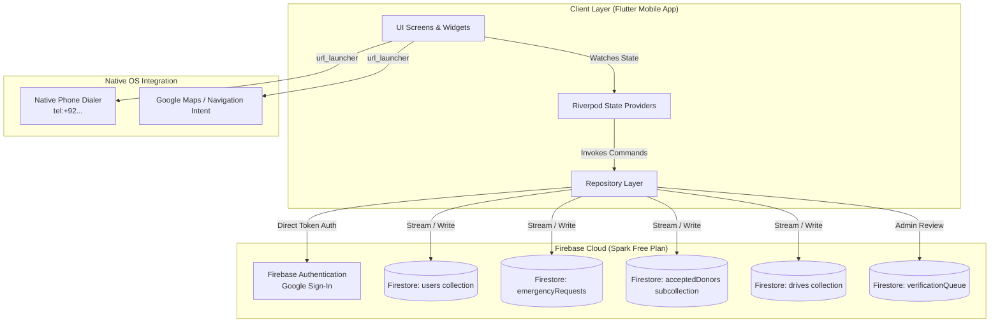
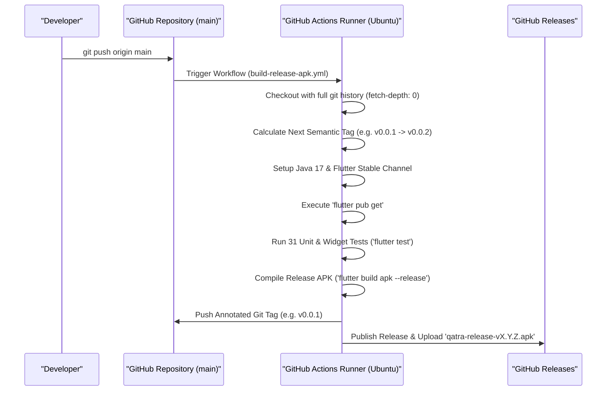

# QATRA (قطرہ) — Alkhidmat Emergency Blood Response Platform

[](https://github.com/abdulhayykhan/QATRA-Mob-App/actions/workflows/build-release-apk.yml)
[](https://flutter.dev)
[](https://dart.dev)
[](LICENSE)
[](https://github.com/abdulhayykhan/QATRA-Mob-App)
[-success)](test/)
[-FFA611?logo=firebase)](https://firebase.google.com)

> **"And whoever saves a life, it is as if he had saved the entirety of mankind."** — *Surah Al-Ma'idah (5:32)*

**QATRA (قطرہ)** is an emergency, real-time, proximity-ranked blood response platform engineered specifically for the urban density and healthcare dynamics of **Karachi, Pakistan**. Developed in strategic alignment with **Alkhidmat Foundation Pakistan**, QATRA eliminates the chaos, misinformation, delays, and predatory black-market commercialization of traditional WhatsApp/social media forward chains by introducing a verified, localized, rapid-dispatch mobile application built **entirely on 100% free-tier, zero-cost cloud infrastructure**.

---

## Table of Contents

1. [The Crisis: Why QATRA Exists](#1-the-crisis-why-qatra-exists)
2. [Core Design Decisions & Free-Tier Infrastructure](#2-core-design-decisions--free-tier-infrastructure)
3. [System Architecture & Data Topology](#3-system-architecture--data-topology)
4. [End-to-End User Workflows](#4-end-to-end-user-workflows)
   - [4.1 Emergency Seeker Workflow](#41-emergency-seeker-workflow)
   - [4.2 Verified Donor Workflow](#42-verified-donor-workflow)
   - [4.3 Desk Admin & Fraud Audit Workflow](#43-desk-admin--fraud-audit-workflow)
5. [Medical & Spatial Matching Engine](#5-medical--spatial-matching-engine)
   - [5.1 ABO & Rh Compatibility Matrix](#51-abo--rh-compatibility-matrix)
   - [5.2 Concentric Haversine Spatial Geofencing](#52-concentric-haversine-spatial-geofencing)
   - [5.3 Urban ETA Transit Estimator](#53-urban-eta-transit-estimator)
   - [5.4 Biological Cooldown & Pre-Screening Engine](#54-biological-cooldown--pre-screening-engine)
6. [Security Architecture & Firestore Authorization Hardening](#6-security-architecture--firestore-authorization-hardening)
   - [6.1 The Subcollection Dispatch Invariant (Issue #21)](#61-the-subcollection-dispatch-invariant-issue-21)
   - [6.2 Complete Firestore Security Rules Matrix](#62-complete-firestore-security-rules-matrix)
7. [Trust & Safety: Real Data vs. Simulated Demo Mode](#7-trust--safety-real-data-vs-simulated-demo-mode)
8. [Codebase Organization & Directory Structure](#8-codebase-organization--directory-structure)
9. [Riverpod State Management Architecture](#9-riverpod-state-management-architecture)
10. [CI/CD Pipeline, Automated Tagging & Release Workflow](#10-cicd-pipeline-automated-tagging--release-workflow)
11. [Karachi Hospitals Pre-Configured Database](#11-karachi-hospitals-pre-configured-database)
12. [Local Setup, Development & Testing Guide](#12-local-setup-development--testing-guide)
13. [Contributing & Code Standards](#13-contributing--code-standards)
14. [License & Acknowledgments](#14-license--acknowledgments)

---

## 1. The Crisis: Why QATRA Exists

Karachi is a megacity of over 20 million residents. Every day, thousands of patients require urgent blood transfusions due to road traffic trauma, obstetric hemorrhages, chemotherapy, major surgeries, and congenital hemoglobin disorders such as **Thalassaemia Major** (Pakistan has one of the highest carrier rates in South Asia, with over 100,000 active patients requiring bi-weekly transfusions).

### The Failure of Traditional Social Coordination
Historically, when a patient in Karachi needs urgent blood, families resort to:
1. **WhatsApp Broadcast Chains**: Messages forwarded across dozens of groups containing patient names, mobile numbers, and hospital wards.
2. **Facebook Blood Groups**: Desperate posts that circulate for days or weeks, frequently after the patient has already passed away or recovered.
3. **Predatory Blood Resellers**: Commercial touts operating outside major tertiary trauma centers (e.g., JPMC, Civil Hospital) charging exorbitant prices (PKR 10,000–30,000 per unit) for unsafe, contaminated blood.
4. **Severe Privacy Breaches**: Unprotected personal contact numbers—particularly of female family members—are exposed permanently on public internet forums.

### The QATRA Solution
QATRA replaces these broken mechanisms with a **closed-loop, verified emergency network**:
- **Verified Requisition Slips**: 100% of requests must be substantiated with official hospital requisition slips containing patient MRN, doctor signatures, and hospital stamps, validated by Alkhidmat's 24/7 desk.
- **Dynamic Concentric Radar**: Proximity alerts are broadcast in real-time to verified donors situated within concentric radius bands (5 km, 10 km, 15 km) of the treating hospital.
- **Direct P2P Calling**: When a donor accepts dispatch, the seeker communicates directly via phone call (`tel:+92...`) with zero telephony middlemen.
- **Strict Cooldown Enforcement**: Donors are algorithmically placed on a 90-day biological safety cooldown to protect donor health and ensure blood draw integrity.

```
Traditional Flow:
[Emergency] ──> [Desperate WhatsApp Message] ──> [Viral Forwarding] ──> [Spam/Scams] ──> [4–8 Hours Delay]

QATRA Flow:
[Emergency] ──> [Slip Upload & Desk Review] ──> [Spatial Radar Broadcast] ──> [Donor Accepts] ──> [Direct Call & Navigation] ──> [<45 Mins Draw]
```

---

## 2. Core Design Decisions & Free-Tier Infrastructure

To ensure QATRA can be deployed and operated sustainably by non-profit foundations without recurring software licensing fees, the entire system is architected to run **100% on free-tier cloud infrastructure**:

| Functional Area | Conventional Paid Approach | QATRA Free-Tier Implementation | Cost |
| :--- | :--- | :--- | :--- |
| **Authentication** | Twilio / Firebase Phone SMS OTP ($0.05 per SMS) | **Google Sign-In Only** (`google_sign_in` + `firebase_auth`). Eliminates thousands of dollars in monthly SMS OTP billing. | **$0.00 / month** |
| **Push & Alerts** | Paid SMS Gateways (Telenor/Jazz SMS API) | **In-App Real-Time Firestore Listeners** + Transactional Email (Resend / Brevo free tiers). | **$0.00 / month** |
| **Donor Coordination** | Masked VoIP / Twilio Voice Proxy Calling | **Direct Native Telephony** (`url_launcher` using `tel:+92XXXXXXXXXX`). Seeker calls donor directly over GSM. | **$0.00 / month** |
| **Database & Sync** | Enterprise Managed SQL / AWS DynamoDB | **Cloud Firestore (Spark Free Plan)**: Real-time document snapshot streams with subcollection-based atomic isolation. | **$0.00 / month** |
| **Map Rendering** | Google Maps SDK ($7 per 1,000 loads) | **Karachi Spatial Concentric Radar Canvas** (Custom Painter) + OpenStreetMap / `flutter_map` integration. | **$0.00 / month** |
| **CI/CD & Builds** | Paid Cloud Build / Bitrise ($40–100/mo) | **GitHub Actions Free Runner** (2,000 minutes/month on public repo) with automatic tag & APK release publishing. | **$0.00 / month** |

---

## 3. System Architecture & Data Topology

QATRA utilizes a unidirectional reactive architecture powered by **Flutter**, **Riverpod**, and **Cloud Firestore**:



---

## 4. End-to-End User Workflows

### 4.1 Emergency Seeker Workflow
1. **Request Formulation**: Seeker enters patient clinical requisition details:
   - Recipient Full Name & Contact Number.
   - ABO & Rh Blood Group ($A+, A-, B+, B-, AB+, AB-, O+, O-$).
   - Component Type: Whole Blood, Packed Red Blood Cells (PRBCs), Platelets (Single Donor Platelet / Random Donor Platelet), Fresh Frozen Plasma (FFP), or Cryoprecipitate.
   - Units Required (e.g., 2 Units).
   - Urgency Tier: High Urgency ($<2$ hours) or Standard Urgency ($<24$ hours).
2. **Hospital Selection**: Selects treating facility from pre-indexed Karachi medical complexes (JPMC, Civil Hospital, Indus Hospital, Liaquat National, Aga Khan University Hospital, SIUT, etc.).
3. **Requisition Slip Capture**: Photographs hospital blood bank slip displaying Medical Record Number (MRN) and consultant stamp.
4. **24/7 Desk Review**: Request transitions to `pendingVerification` and queues into the admin desk portal for immediate cross-checking.
5. **Spatial Proximity Broadcasting**: Upon approval, status transitions to `broadcasting`. All eligible donors within the active radius (5–15 km) receive the emergency alert.
6. **Live Matchmaker Dashboard**: Seeker opens real-time dashboard:
   - While awaiting donors, an animated radar display informs the family of active broadcasts.
   - As donors tap "Accept Dispatch", their verified contact cards populate instantly via Firestore subcollection stream.
7. **Direct Coordination**: Seeker taps **"Contact Donor"** to immediately place a voice call via `tel:+92...` to coordinate arrival at the hospital blood bank.
8. **WhatsApp Verified Card**: A single tap copies or shares an official cryptographic summary link for WhatsApp distribution.
9. **Fulfillment**: Once all units are drawn, the seeker marks the request `fulfilled`.

### 4.2 Verified Donor Workflow
1. **Google Sign-In**: Rapid authentication using Google credentials; user profile auto-created.
2. **Profile & CNIC Binding**: Donor registers Pakistani CNIC (`42101-XXXXXXX-1`), mobile number, primary district (e.g., Karachi South, Karachi Central, Gulshan-e-Iqbal), and confirmed blood group.
3. **Health Pre-Screening**: Completes 5-point physical eligibility checklist:
   - Weight $\ge 50\text{ kg}$.
   - Age between 18 and 60 years.
   - No tattoos, major dental procedures, or surgeries in preceding 6 months.
   - No acute illness, fever, or antibiotic therapy in the preceding 14 days.
   - Female donors: Not pregnant, lactating, or experiencing acute postpartum period.
4. **Live Proximity Feed**: Real-time card stream displays compatible emergency requests in Karachi sorted by proximity and urgency.
5. **Concentric Proximity Map**: Interactive radar canvas showing user location, concentric rings (5 km, 10 km, 15 km), hospital markers, and calculated driving ETA.
6. **Dispatch Acceptance**: Donor taps **"Accept Dispatch"**:
   - System registers donor UID directly into `/emergencyRequests/{requestId}/acceptedDonors/{user.uid}`.
   - Transitions donor to active turn-by-turn routing screen.
7. **Navigation**: Quick-action button launches turn-by-turn navigation directly to the hospital's dedicated blood bank reception.
8. **Blood Draw & Cooldown**: Once drawn, donor taps "I Have Donated Blood":
   - System automatically locks donor profile into a **90-Day Biological Cooldown**.
   - Profile increments "Lives Saved" badge counter.
   - A circular countdown clock displays remaining days until next eligible donation date.

### 4.3 Desk Admin & Fraud Audit Workflow
1. **Verification Queue**: Dedicated desk view for Alkhidmat 24/7 operators displaying pending slip submissions.
2. **Requisition Slip Audit**: Operators inspect uploaded imagery for valid hospital letterhead, stamped MRN, and doctor signature.
3. **Single-Tap Approval / Rejection**: Approving pushes the request to live broadcasting across the metropolitan network; rejecting alerts the seeker with a specific rationale (e.g., illegible stamp).
4. **Fraud Detection & Blacklist Monitoring**: Automatically detects duplicate MRN submissions across different seeker accounts or high-frequency requests from identical numbers (anti-commercial reseller protection).

---

## 5. Medical & Spatial Matching Engine

### 5.1 ABO & Rh Compatibility Matrix

QATRA strictly implements clinical transfusion compatibility protocols:

```
                  RECIPIENT BLOOD GROUP (Seeker)
DONOR      O-     O+     B-     B+     A-     A+     AB-    AB+
O-       [YES]  [YES]  [YES]  [YES]  [YES]  [YES]  [YES]  [YES]  (Universal Donor)
O+        NO    [YES]   NO    [YES]   NO    [YES]   NO    [YES]
B-        NO     NO    [YES]  [YES]   NO     NO    [YES]  [YES]
B+        NO     NO     NO    [YES]   NO     NO     NO    [YES]
A-        NO     NO     NO     NO    [YES]  [YES]  [YES]  [YES]
A+        NO     NO     NO     NO     NO    [YES]   NO    [YES]
AB-       NO     NO     NO     NO     NO     NO    [YES]  [YES]
AB+       NO     NO     NO     NO     NO     NO     NO    [YES]  (Universal Recipient)
```

The matching logic in [`BloodGroup`](lib/core/models/blood_models.dart) is verified with comprehensive unit tests:
```dart
bool canDonateTo(BloodGroup recipient) {
  if (this == BloodGroup.oNegative) return true; // Universal donor
  if (recipient == BloodGroup.abPositive) return true; // Universal recipient
  if (this == recipient) return true;
  // Component compatibility rules
  return compatibleRecipients.contains(recipient);
}
```

### 5.2 Concentric Haversine Spatial Geofencing

Distance between donors and emergency hospital coordinates is computed using the Great-Circle Haversine formula:

$$d = 2R \cdot \arcsin\left(\sqrt{\sin^2\left(\frac{\Delta\phi}{2}\right) + \cos(\phi_1)\cos(\phi_2)\sin^2\left(\frac{\Delta\lambda}{2}\right)}\right)$$

Where:
- $\phi_1, \phi_2$ represent donor and hospital latitudes in radians.
- $\Delta\phi = \phi_2 - \phi_1$ and $\Delta\lambda = \lambda_2 - \lambda_1$.
- $R = 6371\text{ km}$ (mean radius of Earth).

The implementation formats distances dynamically:
- Under $1\text{ km}$: Formatted in meters (e.g., `450 m`).
- At or over $1\text{ km}$: Formatted in kilometers (e.g., `3.4 km`).

### 5.3 Urban ETA Transit Estimator

Karachi's traffic patterns exhibit high variability across arterial routes (Shahrah-e-Faisal, M-9 Motorway, University Road, Korangi Industrial Road). QATRA utilizes an urban speed attenuation formula:

$$\text{ETA (minutes)} = \text{round}\left( \frac{\text{Distance (km)}}{\text{Average Speed (km/h)}} \times 60 \right)$$

- Tight Urban ($<5\text{ km}$): Average speed estimated at $22\text{ km/h}$.
- Medium Arterial ($5–15\text{ km}$): Average speed estimated at $30\text{ km/h}$.
- Buffer: Minimum floor of 5 minutes added for hospital parking and gate clearance.

### 5.4 Biological Cooldown & Pre-Screening Engine

To prevent donor iron deficiency, anemia, and physiological exhaustion:
- **Whole Blood Cooldown**: Fixed at **90 days**.
- **Plateletpheresis Cooldown**: Set at **14 days**.
- **Days Remaining Calculation**:
  $$\text{Days Remaining} = 90 - \left\lfloor \frac{\text{now} - \text{lastDonationDate}}{86400 \times 1000} \right\rfloor$$
- If $\text{Days Remaining} > 0$, the donor profile is automatically flagged as `isOnCooldown = true` and disqualified from receiving proximity dispatch alerts until the countdown reaches 0.

---

## 6. Security Architecture & Firestore Authorization Hardening

### 6.1 The Subcollection Dispatch Invariant (Issue #21)

In early prototyping, donor dispatch writes were performed by modifying an array of `matchedDonors` on the root document `/emergencyRequests/{requestId}` using `affectedKeys().hasOnly(['matchedDonors', 'status'])`.

#### The Vulnerability Identified in Audit
Firestore Security Rules evaluate documents atomically and cannot inspect individual elements of a modified array without brittle set logic. Consequently, **any authenticated user** (even a malicious actor) could:
1. Overwrite the entire `matchedDonors` array, wiping out legitimate donors responding to someone else's emergency.
2. Inject arbitrary, fraudulent donor names and phone numbers, causing desperate seekers to dial scam numbers via the "Contact Donor" button.
3. Change the `status` of an active emergency to `cancelled` or `fulfilled`, silencing live emergency broadcasts across Karachi.

#### The Subcollection Solution
QATRA resolved this vulnerability by isolating dispatches into a dedicated subcollection:

$$\text{Path: } \texttt{/emergencyRequests/\{requestId\}/acceptedDonors/\{donorId\}}$$

```
/emergencyRequests/{requestId}                    <-- Seeker & Admin ONLY
  ├── seekerId: "user-101"
  ├── status: "broadcasting"
  ├── hospital: "JPMC"
  │
  └── /acceptedDonors/{donorId}                  <-- Strictly donorId == request.auth.uid
        ├── id: "donor-502"
        ├── donorName: "Zubair Ahmed"
        ├── phoneNumber: "+92 300 1234567"
        └── status: "Accepted Dispatch"
```

### 6.2 Complete Firestore Security Rules Matrix

Here is the exact security rules configuration deployed in [`firestore.rules`](firestore.rules):

```rules
rules_version = '2';

service cloud.firestore {
  match /databases/{database}/documents {
    
    // Helper functions
    function isAuthenticated() {
      return request.auth != null;
    }
    
    function isOwner(userId) {
      return isAuthenticated() && request.auth.uid == userId;
    }
    
    function isAdmin() {
      return isAuthenticated() && 
        (request.auth.token.role == 'admin' || 
         get(/databases/$(database)/documents/users/$(request.auth.uid)).data.role == 'admin');
    }

    // 1. Users collection
    match /users/{userId} {
      allow read: if isAuthenticated();
      allow create: if isAuthenticated() && request.auth.uid == userId;
      allow update: if isOwner(userId) || isAdmin();
      allow delete: if isAdmin();
    }

    // 2. Emergency Requests collection
    match /emergencyRequests/{requestId} {
      allow read: if isAuthenticated();
      allow create: if isAuthenticated();
      // Parent document locked strictly to the creator seeker or desk admin
      allow update: if isAuthenticated() && 
        (request.auth.uid == resource.data.seekerId || isAdmin());
      allow delete: if isAdmin();

      // Subcollection for donors who accepted dispatch
      match /acceptedDonors/{donorId} {
        allow read: if isAuthenticated();
        // Donor can ONLY write their own record matching their authenticated UID
        allow create, update: if isAuthenticated() && 
          request.auth.uid == donorId &&
          request.resource.data.id == donorId;
        // Delete allowed by donor (canceling dispatch), the seeker, or an admin
        allow delete: if isAuthenticated() && (
          request.auth.uid == donorId || 
          request.auth.uid == get(/databases/$(database)/documents/emergencyRequests/$(requestId)).data.seekerId || 
          isAdmin()
        );
      }
    }

    // 3. Campus Blood Drives collection
    match /drives/{driveId} {
      allow read: if true;
      allow create, update: if isAuthenticated();
      allow delete: if isAdmin();
    }

    // 4. 24/7 Verification Queue & Fraud Audit
    match /verificationQueue/{slipId} {
      allow read, write: if isAdmin();
    }
    
    match /fraudAudit/{auditId} {
      allow read, write: if isAdmin();
    }
  }
}
```

---

## 7. Trust & Safety: Real Data vs. Simulated Demo Mode

In life-critical medical software, silently displaying fake/mock patients (e.g., "Ahmed Khan", "Fatima Zahra") when a database query returns empty is dangerous. A user might believe a real emergency exists nearby and attempt to travel to a hospital.

### Production Stream Behavior
- All repositories (`EmergencyRequestsRepository`, `DrivesRepository`) query Cloud Firestore directly.
- If a collection or stream is empty, the repository returns an honest empty list (`[]`).
- The UI renders reassurance cards:
  - **Donor Home**: *"All Clear • 0 Active Emergencies Near You. All hospital requests in Karachi are currently covered."*
  - **Social Feed**: *"No Pending Blood Requests in Selected Filters."*
  - **Live Radar Map**: Neutral hospital pins with *"No Active Emergencies in Selected Radius"*.
  - **Matchmaker Dashboard**: Radar scanning card *"Broadcasting to verified donors within 10 km... Contact cards appear here in real time."*

### Explicit Demo Mode For Testers & Presenters
To facilitate demonstrations, stakeholder reviews, and offline training without creating false database records:
- An explicit Riverpod provider is provided: `isDemoModeProvider = StateProvider<bool>((ref) => false)`.
- When enabled (via the bottom sheet switch in `RoleSwitchSheet`), the app loads pre-configured seed data with prominent visual indicators:
  - Yellow **`[DEMO MODE]`** banner on Donor Home with an **"Exit Demo"** button.
  - Dedicated **`[DEMO]`** tags on the Live Proximity Map and Social Feed.
  - New test requests start with an illustrative accepted donor only when demo mode is active.

---

## 8. Codebase Organization & Directory Structure

The project strictly follows standard Flutter feature-first architectural patterns:

```
QATRA-Mob-App/
├── .github/
│   └── workflows/
│       └── build-release-apk.yml       # Automated CI/CD, auto-tagging, APK compilation & release
├── android/
│   ├── app/
│   │   ├── build.gradle.kts           # Kotlin DSL Gradle build script (minSdk 21, targetSdk 34, Java 17)
│   │   └── google-services.json       # Firebase project binding (Project: qatra-web-app)
│   └── build.gradle.kts
├── docs/                              # Product requirement docs and architecture specifications
├── firestore.rules                    # Production security rules with subcollection authorization
├── lib/
│   ├── core/
│   │   ├── models/
│   │   │   ├── blood_models.dart      # BloodGroup, Hospital, EmergencyRequest, MatchedDonor, DriveEvent
│   │   │   └── user_models.dart       # UserProfile, UserRole (Seeker, Donor, Admin)
│   │   ├── services/
│   │   │   ├── auth_repository.dart   # Google Sign-In & Firestore user document provisioning
│   │   │   ├── drives_repository.dart # Campus blood drives real-time Firestore service
│   │   │   └── emergency_requests_repository.dart # Emergency requests & acceptedDonors subcollection
│   │   ├── theme/
│   │   │   └── app_theme.dart         # QATRA Design System (AppColors, typography, card shapes)
│   │   └── utils/
│   │       ├── cnic_validator.dart    # 13-digit Pakistani CNIC validator & privacy masker
│   │       └── distance_calculator.dart # Haversine kilometer and urban transit ETA formulas
│   ├── features/
│   │   ├── admin/
│   │   │   ├── admin_verification_queue_screen.dart # 24/7 slip review queue
│   │   │   ├── drive_management_screen.dart         # Campus drive creator
│   │   │   └── fraud_audit_screen.dart              # Multi-MRN reseller detection log
│   │   ├── auth/
│   │   │   ├── cnic_binding_screen.dart             # CNIC entry and privacy verification
│   │   │   ├── google_auth_screen.dart              # Google Sign-In with unverified default state
│   │   │   └── profile_setup_screen.dart            # Medical details & district selector
│   │   ├── awareness/
│   │   │   ├── awareness_screen.dart                # Campus blood camps & educational guides
│   │   │   └── drive_details_screen.dart            # University drive registration
│   │   ├── donor/
│   │   │   ├── cooldown_screen.dart                 # 90-day medical cooldown countdown timer
│   │   │   ├── donor_home_screen.dart               # Donor hub, active requests, radar status
│   │   │   └── geo_alert_modal.dart                 # High-urgency incoming dispatch alert modal
│   │   ├── feed/
│   │   │   └── social_feed_screen.dart              # Filterable public feed of Karachi emergencies
│   │   ├── health/
│   │   │   └── health_checklist_screen.dart         # 5-point physical pre-screening validation
│   │   ├── map/
│   │   │   ├── live_map_screen.dart                 # Karachi spatial radar canvas with concentric rings
│   │   │   └── navigation_routing_screen.dart       # Turn-by-turn hospital route & dispatch actions
│   │   ├── onboarding/
│   │   │   └── splash_onboarding_screen.dart        # Alkhidmat partnership introduction flow
│   │   ├── profile/
│   │   │   └── profile_screen.dart                  # User stats, lives saved, CNIC mask, settings
│   │   └── seeker/
│   │       ├── create_request_screen.dart           # Emergency request wizard
│   │       ├── donation_complete_screen.dart         # Thank you & fulfillment receipt
│   │       ├── donor_contact_screen.dart            # Direct coordination & hospital details
│   │       ├── matchmaker_dashboard_screen.dart     # Real-time accepted donors list & call button
│   │       ├── request_status_screen.dart           # Verification status & broadcast radar badge
│   │       └── slip_upload_screen.dart              # OCR requisition slip photograph & submission
│   ├── providers/
│   │   └── app_state_providers.dart                 # Riverpod dependency injection & streams
│   ├── widgets/
│   │   ├── qatra_bottom_nav.dart                    # Bottom navigation bar with role awareness
│   │   ├── role_switch_sheet.dart                   # Role switch modal (Seeker/Donor/Admin + Demo Mode)
│   │   └── status_badges.dart                       # BloodGroupBadge, UrgencyBadge, VerifiedBadge
│   └── main.dart                                    # App entry point with ProviderScope & Firebase init
├── media/                                           # Brand assets & logos
├── test/
│   ├── qatra_core_test.dart                         # 30 comprehensive core model, repo & safety unit tests
│   └── widget_test.dart                             # App smoke test verifying ProviderScope mount
├── pubspec.yaml                                     # Dependencies & Flutter configuration
└── README.md                                        # Exhaustive project documentation
```

---

## 9. Riverpod State Management Architecture

State is managed reactively via **Riverpod 2.5**, decoupling the presentation layer from backend I/O:

```
[Firebase Services]
         │
         ▼
[Repositories] (AuthRepository, EmergencyRequestsRepository, DrivesRepository)
         │
         ▼
[StreamProviders] (activeEmergencyRequestsStreamProvider, campusDrivesStreamProvider)
         │
         ▼
[Computed Providers] (activeEmergencyRequestsProvider, isDemoModeProvider)
         │
         ▼
[UI Consumers] (DonorHomeScreen, MatchmakerDashboardScreen, LiveMapScreen)
```

### Key Providers Matrix

| Provider Name | Type | Purpose |
| :--- | :--- | :--- |
| `userProvider` | `StateNotifierProvider<UserNotifier, UserProfile>` | Manages the active authenticated user profile, role, and cooldown. |
| `isDemoModeProvider` | `StateProvider<bool>` | Developer/testing toggle controlling whether seed mock data is loaded. |
| `emergencyRequestsRepositoryProvider` | `Provider<EmergencyRequestsRepository>` | Injects repository instance connected to Firestore. |
| `drivesRepositoryProvider` | `Provider<DrivesRepository>` | Injects campus drives repository instance. |
| `activeEmergencyRequestsStreamProvider` | `StreamProvider<List<EmergencyRequest>>` | Streams real-time broadcasting emergency requests from Firestore. |
| `activeEmergencyRequestsProvider` | `Provider<List<EmergencyRequest>>` | Resolves live stream in production; cleanly swaps to seed data in demo mode. |
| `activeEmergencyRequestsLoadingProvider` | `Provider<bool>` | Indicates whether live Firestore stream is actively connecting/buffering. |
| `campusDrivesStreamProvider` | `StreamProvider<List<DriveEvent>>` | Streams upcoming campus blood drives from Firestore. |
| `campusDrivesProvider` | `Provider<List<DriveEvent>>` | Resolves live drives in production; cleanly swaps to seed drives in demo mode. |

---

## 10. CI/CD Pipeline, Automated Tagging & Release Workflow

A production-grade continuous integration and continuous deployment pipeline is implemented in [`.github/workflows/build-release-apk.yml`](.github/workflows/build-release-apk.yml).

### Automated Semantic Versioning Formula

The workflow analyzes all existing tags in the repository and automatically computes the next release version following this progression:

$$\text{v0.0.1} \to \text{v0.0.2} \dots \to \text{v0.0.9} \to \textbf{v0.1.0} \to \text{v0.1.1} \dots \to \text{v0.1.9} \to \textbf{v0.2.0} \dots \to \text{v0.9.9} \to \textbf{v1.0.0}$$

```bash
# Algorithm implemented in GitHub Actions step:
if [ $PATCH -lt 9 ]; then
  PATCH=$((PATCH + 1))
else
  PATCH=0
  if [ $MINOR -lt 9 ]; then
    MINOR=$((MINOR + 1))
  else
    MINOR=0
    MAJOR=$((MAJOR + 1))
  fi
fi
NEXT_TAG="v${MAJOR}.${MINOR}.${PATCH}"
```

### Pipeline Flow



Every published release automatically includes:
- Production Android APK (`qatra-release-vX.Y.Z.apk`).
- Auto-generated changelog of commit messages since the previous tag.
- SHA-256 build verification and build run numbers.

---

## 11. Karachi Hospitals Pre-Configured Database

QATRA is pre-configured with the precise geographic coordinates, emergency phone numbers, and districts of Karachi's primary tertiary care facilities:

| ID | Hospital Name | District | Latitude | Longitude | Emergency Contact |
| :--- | :--- | :--- | :--- | :--- | :--- |
| `hosp-01` | **Jinnah Postgraduate Medical Centre (JPMC)** | Karachi South | `24.8532` | `67.0458` | `021-99201300` |
| `hosp-02` | **Dr. Ruth K.M. Pfau Civil Hospital (CHK)** | Karachi South | `24.8596` | `67.0101` | `021-99215740` |
| `hosp-03` | **The Indus Hospital & Health Network (Korangi)** | Korangi | `24.8315` | `67.1244` | `021-111111880` |
| `hosp-04` | **Liaquat National Hospital (LNH)** | Karachi East | `24.8942` | `67.0702` | `021-111456456` |
| `hosp-05` | **Aga Khan University Hospital (AKUH)** | Karachi East | `24.8920` | `67.0745` | `021-111911911` |
| `hosp-06` | **National Institute of Cardiovascular Diseases (NICVD)** | Karachi South | `24.8519` | `67.0431` | `021-99201271` |
| `hosp-07` | **Sindh Institute of Urology & Transplantation (SIUT)** | Karachi South | `24.8584` | `67.0125` | `021-99215752` |
| `hosp-08` | **South City Hospital (Clifton)** | Karachi South | `24.8214` | `67.0312` | `021-35862301` |
| `hosp-09` | **Patel Hospital (Gulshan-e-Iqbal)** | Gulshan | `24.9198` | `67.1001` | `021-111174174` |
| `hosp-10` | **Abbasi Shaheed Hospital (ASH)** | Karachi Central| `24.9211` | `67.0322` | `021-99260400` |

---

## 12. Local Setup, Development & Testing Guide

### Prerequisites
- **Flutter SDK**: `^3.41.8` (stable channel).
- **Dart SDK**: `^3.11.5`.
- **Java Development Kit**: JDK 17 (Temurin recommended).
- **Android SDK**: API level 34 with Android Build Tools.
- **Git**: Installed and configured.

### Installation Steps

1. **Clone the repository**:
   ```bash
   git clone https://github.com/abdulhayykhan/QATRA-Mob-App.git
   cd QATRA-Mob-App
   ```

2. **Install Flutter dependencies**:
   ```bash
   flutter pub get
   ```

3. **Verify Firebase Configuration**:
   The repository includes the pre-configured `android/app/google-services.json` tied to the project `qatra-web-app`. If using your own Firebase project:
   ```bash
   flutterfire configure --project=YOUR_FIREBASE_PROJECT_ID
   ```

4. **Execute Static Code Analysis**:
   ```bash
   flutter analyze
   ```
   *Expected result: `No issues found!` (0 errors, 0 warnings).*

5. **Run the Automated Test Suite**:
   ```bash
   flutter test
   ```
   *Expected result: `All tests passed! (+31)` (100% pass rate across all unit, boundary, and smoke tests).*

6. **Launch the Application**:
   - For Android emulator or connected device:
     ```bash
     flutter run
     ```
   - For Release mode testing:
     ```bash
     flutter run --release
     ```

7. **Compile Release APK Locally**:
   ```bash
   flutter build apk --release
   ```
   The compiled APK will be generated at `build/app/outputs/flutter-apk/app-release.apk`.

---

## 13. Contributing & Code Standards

We welcome contributions from engineers, healthcare professionals, and students. To maintain software reliability in a life-critical domain, all pull requests must strictly adhere to the following standards:

1. **Zero Linter Warnings**: Every commit must pass `flutter analyze` with 0 warnings and 0 errors.
2. **Mandatory Test Coverage**: Any new feature or bug fix must be accompanied by unit tests in `test/qatra_core_test.dart`.
3. **No Unauthenticated Bypasses**: Never re-introduce hardcoded bypasses or unauthenticated writes to `emergencyRequests`.
4. **Subcollection Integrity**: All donor-specific records must remain isolated in `/emergencyRequests/{requestId}/acceptedDonors/{donorId}`.
5. **No SMS Gateway Introductions**: Do not add paid telephony SDKs without prior written approval from project maintainers.
6. **Git Commit Format**: Use Conventional Commits (`feat:`, `fix:`, `refactor:`, `test:`, `docs:`).

---

## 14. License & Acknowledgments

### License
This project is licensed under the **MIT License** — see the [LICENSE](LICENSE) file for details.

### Acknowledgments
- **Alkhidmat Foundation Pakistan (Karachi Chapter)** — For clinical guidance, field logistics support, and verification desk operation.
- **Dawood University of Engineering & Technology (DUET)** — For student volunteer mobilization and youth donor advocacy.
- **The Blood Donors of Karachi** — Who step forward quietly in the middle of the night to save lives.

---

<p align="center">
  <b>QATRA (قطرہ) — Every Drop Counts. Every Second Matters.</b><br>
  Developed with ❤️ for Karachi, Pakistan.
</p>
